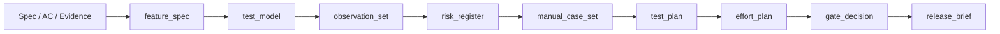
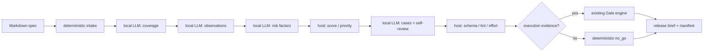

# Blueprint

## 1. Problem Statement

`manual-bb-test-harness` は、仕様から直接ケースを量産するのではなく、  
coverage model、観点、リスク、ケース、gate、release brief を段階的に接続し、  
手動ブラックボックス QA を監査可能な chain として扱うための Skill repo である。

Web だけでなく iOS / Android も対象に含めるため、mobile 固有の lifecycle、権限、
通知入口、network 差分も coverage model の first-class 要素として扱う。

## 2. Scope

- In:
  - `phase_contract` から `release_brief` までの artifact 契約
  - 手動 black-box を主軸にした観点抽出、リスク付け、case synthesis
  - schema / example / golden / evaluation rubric の同期
  - Web / API / iOS / Android をまたぐ対象環境差分
  - TestRail / Xray / Notion 連携用の export / import 補助
  - OpenAI互換のllama.cpp / LM Studioを使う明示的なlocal-design経路
- Out:
  - 実機クラウドや MDM など mobile 実行基盤の構築
  - 自動テストフレームワークそのものの実装
  - 外部 SaaS の本番運用設定
  - 各プロダクト固有の業務ルール正本
  - cloud providerからlocal modelへの自動failover
  - Ollama native API

## 3. Constraints / Assumptions

- `SKILL.md` は短く保ち、詳細な方針は `references/` に分離する。
- scripted case には oracle と traceability を必須にする。
- `black` を release acceptance の主役とし、`gray` / `white` は補助証跡に留める。
- artifact contract を変えるときは `schemas/`、`examples/artifacts/`、`goldens/` を同時更新する。
- mobile 対象では `platform_matrix` を必須 lens として扱う。
- golden は厳密 snapshot ではなく review anchor として扱う。
- local modelは意味候補の生成器であり、risk/effort算術とGate権限はhostが持つ。
- local endpointは既定でloopbackに限定し、artifact repairは1段階につき最大1回とする。

## 4. I/O Contract

- Input:
  - 仕様、受入条件、業務ルール、変更点、既存証跡
  - 必要に応じて対象端末、OS、mobile context、既知 defect、waiver
- Output:
  - `phase_contract`
  - `feature_spec`
  - `requirements_review`（任意の要件レビュー入力）
  - `requirements_confidence`（要件定義の信頼度評価）
  - `test_model`
  - `observation_set`
  - `risk_register`
  - `technique_plan`
  - `manual_case_set`
  - `test_plan`
  - `coverage_report`
  - `effort_plan`
  - `gate_decision`
  - `release_brief`
  - `execution_evidence`
  - `automation_evidence`
  - `defect_register`
  - `local_run_manifest`

## 5. Minimal Flow

要件の不確実性を評価する場合は、feature_specと任意のphase_contract・requirements_reviewから`evaluate requirements`でrequirements_confidenceを計算する。採点はホスト側だけで行い、根拠・入力版を固定する。Ready・生成品質採点・リリースGateの権限は維持する。契約は[spec-07](docs/specs/spec-07-requirements-confidence.md)を参照。

### Local model flow

LLM応答は既存artifact schemaで拘束する。失敗artifactだけを1回repairし、再失敗時は部分成果物とfailed manifestを残して非ゼロ終了する。raw promptとAPI keyはmanifestへ保存しない。

## RanDとの責務境界

RanDはR&D成果物を生成し、manual-bbは`import rand`で要求候補・監査・文書・handoffを取り込む。`rand_intake`で原文と不確実性、変更範囲、既知欠陥を保持し、既存のfeature_spec以降の設計へ渡す。[連携仕様](docs/tasks/task-rand-integration-20260912.md)を正本とする。

## 6. Interfaces

- Skill:
  - `skills/manual-bb-test-harness/SKILL.md`
- Schemas:
  - `schemas/*.schema.json`
- Examples:
  - `examples/artifacts/*.json`
- Evaluation:
  - `docs/evaluation-rubric.md`
  - `goldens/*.expected.md`
- Scripts:
  - `scripts/spec-ingest.py`
  - `scripts/evaluate-gate.py`
  - `scripts/export-testrail.py`
  - `scripts/export-xray.py`
- Local runtime:
  - `src/bb_harness/local_runtime.py`
  - `src/bb_harness/local_pipeline.py`
  - `src/bb_harness/local_profiles.yaml`
  - `docs/local-model-guide.md`

## 生成効率・証跡版（2026-09-10）

追加設計は[spec-05](docs/specs/spec-05-efficient-generation-evidence-revisions.md)。`efficient_generation`が未被覆入力とレビュー差分、`token_budget`が呼出予約とusage集計、`evidence_revisions`がケース本文・モデルの版を担当する。coverageとGateで版を照合し、旧形式はlegacy_unverifiedを明示する。

## 分割生成・完了判定（2026-09-10）

`batched_generation`はモデル概要／技法と、ケース／レビューの有限な分割を担当する。`design_status`は生成statusと別に設計の不足を表す。比較は実ファイルのschema/hashと再計算した被覆を確認する。[spec-06](docs/specs/spec-06-bounded-generation-readiness.md)を正本とする。
