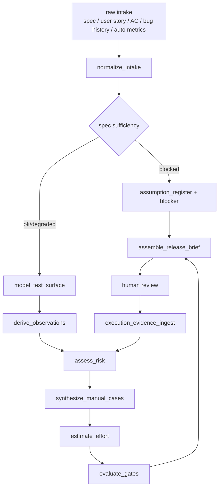
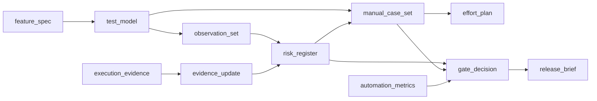

# 手動ブラックボックス前提のテストハーネスエージェントスイート設計報告

## エグゼクティブサマリー

この用途では、**巨大な一枚岩エージェント**より、**短い責務を持つ複数 skill を JSON 契約でつなぐハーネス**の方がよいです。最近のハーネス設計ガイドは、長大な指示書ではなく「短い索引ファイル + 分割された source of truth 文書」を置き、人間が steering し、ガイドとセンサーを改善し続ける構造を勧めています。さらに、AI テスト設計を信頼できる運用にするには、入力の正規化、構造化モデル化、制約付き生成、検証、監査可能な traceability を段階化する必要があります。 citeturn20view0turn20view6turn20view7turn15view8turn24view0turn14view4

手動ブラックボックス前提でも、コア技法は十分に現役です。Foundation の芯は **同値分割・境界値分析・デシジョンテーブル・状態遷移**で、経験ベース技法はそれらを補完します。最新の Test Analyst 更新版も、test analyst が **black-box と experience-based を主に使い**、リスクベース、変更影響に基づく回帰範囲、テストデータ要件、オラクル決定、テストケース品質基準まで扱う方向に広がっています。産業調査レビューでも、black-box と experience-based が white-box より広く使われ、現場はなお手動テストに大きく依存しています。 citeturn36view0turn37view0turn40view1turn40view2turn39search1turn22view0turn23view2

推奨する出力連鎖は、**根拠付き観点 → リスク → 優先度 → 手動テストケース → 工数 → Gate 判定 → Go/No-Go brief**です。リスクは **impact × likelihood** を基底にしつつ、manual black-box 実務で効く **detectability、変更波及、外部依存、権限感度、既存自動テストの有無**で補正するのが最も説明しやすく、FMEA の RPN は補助指標に留めるのが妥当です。 citeturn21view1turn34view1turn15view12turn35view0

品質ゲートは、**コードカバレッジ単体ではなく**、**新規変更の自動テスト証跡 + 手動 P0/P1 実行結果 + 欠陥状態 + 残余リスク**の複合ゲートにしてください。公開ガイドでも quality gate は「release readiness」を判定する条件集合であり、新規コードの issue・coverage・duplication を重視しますが、別の実務ガイドでは「理想の coverage 数値は一つではなく、何が未カバーかを人間が判断する方が重要」と明言しています。 citeturn16view1turn16view2turn16view3turn16view5turn13view12

AI 生成のばらつき対策は必須です。ある日本の実験では、同じ入力・同じプロンプトでも run ごとの観点カバレッジ差が大きく、重要仕様は **1 回生成を鵜呑みにせず 3〜5 回生成して比較**する方針が示唆されました。したがって本設計では、**高リスク feature にだけ multi-run + merge** を入れ、低リスク feature は 1 run で済ませるのがコスパのよい落としどころです。 citeturn27view1turn27view2turn15view14

## 設計原則

まず、テストハーネスの基準面は **仕様準拠の black-box** に固定し、その上に **experience-based の探索的補完**と、必要最低限の **gray/white 補助情報**を載せる構造にします。Test techniques は「what to test / how to test」を支え、coverage item と test data の識別にも使えるので、suite の内部中間表現は **flow / rule / state / data / role / regression impact** に分解するのが自然です。 citeturn36view0turn37view0turn40view1

次に、source of truth は一箇所に散らさず、**短い map** から辿れるようにします。長い AGENTS.md 一枚に全部書くのではなく、短い索引から `docs/` 内の rule, spec, defect history, exec plan に分ける設計が、最近のハーネス設計では推奨されています。context は有限資源なので、「長い説明」より「短い索引 + 深い参照先」の方が安定します。 citeturn20view0turn15view8

さらに、suite 全体は **feedforward guides** と **feedback sensors** に分けて考えると整理しやすいです。guide は schema, prompt, rule pack, checklist, device matrix のような「先回り制約」、sensor は schema validator, traceability checker, coverage checker, duplicate detector, gate evaluator, 実行証跡の anomaly classifier のような「後追い観測」です。人間の役割はケースを逐一手直しすることではなく、**同じ失敗が繰り返されたら harness 側を改善して再発確率を下げること**です。 citeturn20view6turn20view7turn15view3

最後に、manual black-box でも品質の視点は機能だけに閉じません。25010 の更新版は製品品質モデルを開発者観点の品質特性として定義しており、new TA でも functional だけでなく usability, flexibility/adaptability, compatibility を扱います。つまり suite は、機能観点の外に **互換性、利用状況依存、環境差、ユーザー体験差**の lens を持つべきです。 citeturn38view0turn4search10turn40view1

以下の flow を、最小で十分な orchestrator として推奨します。これは source-of-truth 正規化 → 中間モデル化 → 観点生成 → リスク評価 → 最小ケース化 → 工数化 → Gate という順で、後段ほど deterministic checker を増やす構成です。 citeturn24view0turn20view0turn20view6turn16view1



## スキル分割

推奨は **8 core skills + 1 optional feedback skill** です。各 skill は「判断責務を 1 個」「主要出力を 1 個」に固定し、横断責務は orchestrator に持たせます。こうすると JSON 契約が安定し、差し替えや A/B 評価がしやすくなります。 citeturn29view0turn20view0turn24view0

| skill_id | 1判断責務 | 1主要出力 | 内部ロジックの要点 |
|---|---|---|---|
| `normalize_intake` | 入力仕様がテスト設計に足りるか判定する | `feature_spec` | 受入条件・業務ルール・変更点・欠落情報・source confidence を正規化 |
| `model_test_surface` | flow / state / rule / data / role / regression のどのモデルを作るか判定する | `test_model` | 観点の母集合になる coverage item を抽出 |
| `derive_observations` | 必須観点と任意観点を切り分ける | `observation_set` | black-box 技法 + 探索チャーター候補を作る |
| `assess_risk` | 各観点をどの優先度帯に置くか判定する | `risk_register` | score 計算、P0〜P3 付与、根拠文生成 |
| `synthesize_manual_cases` | 最小の手動ケース集合に圧縮する | `manual_case_set` | weighted set cover + dedupe + exploratory charters 追加 |
| `estimate_effort` | 実行順と工数見積りを決める | `effort_plan` | prep / exec / evidence / retry buffer を算出 |
| `evaluate_gates` | release gate を Go / Conditional Go / No-Go で判定する | `gate_decision` | 自動テスト証跡・手動結果・欠陥・残余リスクを照合 |
| `assemble_release_brief` | ステークホルダーに何を見せるか判定する | `release_brief` | 1 ページ要約、未解決事項、waiver、判断材料を整形 |
| `ingest_execution_evidence` | 実行結果を pass/fail/anomaly に分類する | `evidence_update` | defect stub、risk 再評価、探索チャーター改善ネタを返す |

skill 間の依存は、共有メモリではなく**型付き artifact**でつなぐ方が堅いです。特に `test_model` と `risk_register` は再利用価値が高く、ここが suite の知的資産になります。 citeturn20view0turn29view0turn24view0



## データ契約

この suite は、**共通 envelope + 再利用型 `$defs`** で十分です。重要なのは「全 skill が同じ source_ref / assumption / confidence / traceability の流儀を使うこと」で、schema を過剰に深くしすぎないことです。最近の harness/tool 設計でも、namespacing、明確な境界、意味のある戻り値、token 効率が重要視されています。 citeturn29view0turn20view0

### マニフェスト雛形

```yaml
suite_id: manual-bb-harness
version: 0.1.0
primary_view: black
critical_multi_run: 3
normal_multi_run: 1
merge_strategy: weighted_union
artifacts:
  - feature_spec
  - test_model
  - observation_set
  - risk_register
  - manual_case_set
  - effort_plan
  - gate_decision
  - release_brief
  - execution_evidence
policies:
  require_source_refs: true
  require_oracle_per_case: true
  require_traceability: true
  degrade_on_missing_info: true
  block_on_missing_critical_oracle: true
  white_view_is_supplementary: true
```

### 共通 JSON Schema 雛形

```json
{
  "$schema": "https://json-schema.org/draft/2020-12/schema",
  "$defs": {
    "SourceRef": {
      "type": "object",
      "required": ["id", "kind"],
      "properties": {
        "id": {"type": "string"},
        "kind": {"enum": ["spec", "ac", "rule", "bug", "auto_test", "code_review", "ops"]},
        "excerpt": {"type": "string"}
      }
    },
    "Assumption": {
      "type": "object",
      "required": ["id", "text", "severity"],
      "properties": {
        "id": {"type": "string"},
        "text": {"type": "string"},
        "severity": {"enum": ["low", "medium", "high", "critical"]},
        "impact_on_coverage": {"type": "string"}
      }
    },
    "FeatureSpec": {
      "type": "object",
      "required": ["feature_id", "title", "acceptance_criteria", "source_refs"],
      "properties": {
        "feature_id": {"type": "string"},
        "title": {"type": "string"},
        "summary": {"type": "string"},
        "actors": {"type": "array", "items": {"type": "string"}},
        "acceptance_criteria": {"type": "array", "items": {"type": "string"}},
        "business_rules": {"type": "array", "items": {"type": "string"}},
        "changed_areas": {"type": "array", "items": {"type": "string"}},
        "devices": {"type": "array", "items": {"type": "string"}},
        "source_refs": {"type": "array", "items": {"$ref": "#/$defs/SourceRef"}},
        "assumptions": {"type": "array", "items": {"$ref": "#/$defs/Assumption"}}
      }
    },
    "TestModel": {
      "type": "object",
      "required": ["feature_id", "flows", "data_dimensions", "roles"],
      "properties": {
        "feature_id": {"type": "string"},
        "flows": {"type": "array", "items": {"type": "string"}},
        "states": {"type": "array", "items": {"type": "string"}},
        "rules": {"type": "array", "items": {"type": "string"}},
        "data_dimensions": {"type": "array", "items": {"type": "string"}},
        "roles": {"type": "array", "items": {"type": "string"}},
        "regression_edges": {"type": "array", "items": {"type": "string"}}
      }
    },
    "Observation": {
      "type": "object",
      "required": ["id", "title", "view", "techniques", "rationale", "source_refs"],
      "properties": {
        "id": {"type": "string"},
        "title": {"type": "string"},
        "view": {"enum": ["black", "gray", "white"]},
        "techniques": {"type": "array", "items": {"type": "string"}},
        "rationale": {"type": "string"},
        "source_refs": {"type": "array", "items": {"$ref": "#/$defs/SourceRef"}}
      }
    },
    "RiskItem": {
      "type": "object",
      "required": ["id", "scenario", "risk_score", "priority"],
      "properties": {
        "id": {"type": "string"},
        "scenario": {"type": "string"},
        "impact": {"type": "integer", "minimum": 1, "maximum": 5},
        "likelihood": {"type": "integer", "minimum": 1, "maximum": 5},
        "detectability": {"type": "integer", "minimum": 0, "maximum": 3},
        "change_surface": {"type": "integer", "minimum": 0, "maximum": 3},
        "externality": {"type": "integer", "minimum": 0, "maximum": 3},
        "privilege_sensitivity": {"type": "integer", "minimum": 0, "maximum": 3},
        "auto_coverage_credit": {"type": "integer", "minimum": 0, "maximum": 3},
        "risk_score": {"type": "integer", "minimum": 0, "maximum": 100},
        "priority": {"enum": ["P0", "P1", "P2", "P3"]},
        "rationale": {"type": "string"}
      }
    },
    "ManualTestCase": {
      "type": "object",
      "required": ["tc_id", "title", "priority", "steps", "expected_results", "oracle"],
      "properties": {
        "tc_id": {"type": "string"},
        "title": {"type": "string"},
        "priority": {"enum": ["P0", "P1", "P2", "P3"]},
        "primary_view": {"enum": ["black", "gray", "white"]},
        "techniques": {"type": "array", "items": {"type": "string"}},
        "preconditions": {"type": "array", "items": {"type": "string"}},
        "steps": {"type": "array", "items": {"type": "string"}},
        "expected_results": {"type": "array", "items": {"type": "string"}},
        "oracle": {
          "type": "object",
          "required": ["type", "refs"],
          "properties": {
            "type": {"enum": ["specified", "derived", "implicit", "human"]},
            "refs": {"type": "array", "items": {"type": "string"}}
          }
        },
        "estimate_minutes": {"type": "number"},
        "trace_to": {"type": "array", "items": {"type": "string"}}
      }
    },
    "GateDecision": {
      "type": "object",
      "required": ["feature_id", "status", "reasons"],
      "properties": {
        "feature_id": {"type": "string"},
        "status": {"enum": ["go", "conditional_go", "no_go"]},
        "reasons": {"type": "array", "items": {"type": "string"}},
        "blocking_risks": {"type": "array", "items": {"type": "string"}},
        "waivers": {"type": "array", "items": {"type": "string"}}
      }
    },
    "ExecutionEvidence": {
      "type": "object",
      "required": ["run_id", "tc_id", "result", "expected", "actual"],
      "properties": {
        "run_id": {"type": "string"},
        "tc_id": {"type": "string"},
        "build_id": {"type": "string"},
        "env": {"type": "string"},
        "device": {"type": "string"},
        "network_profile": {"type": "string"},
        "result": {"enum": ["pass", "fail", "blocked", "not_run"]},
        "expected": {"type": "array", "items": {"type": "string"}},
        "actual": {"type": "array", "items": {"type": "string"}},
        "attachments": {"type": "array", "items": {"type": "string"}},
        "anomaly_notes": {"type": "array", "items": {"type": "string"}}
      }
    }
  },
  "skills": {
    "normalize_intake": {"input": {"$ref": "#/$defs/FeatureSpec"}, "output": {"$ref": "#/$defs/FeatureSpec"}},
    "model_test_surface": {"input": {"$ref": "#/$defs/FeatureSpec"}, "output": {"$ref": "#/$defs/TestModel"}},
    "derive_observations": {"input": {"$ref": "#/$defs/TestModel"}, "output": {"type": "array", "items": {"$ref": "#/$defs/Observation"}}},
    "assess_risk": {"input": {"type": "array", "items": {"$ref": "#/$defs/Observation"}}, "output": {"type": "array", "items": {"$ref": "#/$defs/RiskItem"}}},
    "synthesize_manual_cases": {"input": {"type": "object"}, "output": {"type": "array", "items": {"$ref": "#/$defs/ManualTestCase"}}},
    "estimate_effort": {"input": {"type": "array", "items": {"$ref": "#/$defs/ManualTestCase"}}, "output": {"type": "object"}},
    "evaluate_gates": {"input": {"type": "object"}, "output": {"$ref": "#/$defs/GateDecision"}},
    "assemble_release_brief": {"input": {"type": "object"}, "output": {"type": "object"}},
    "ingest_execution_evidence": {"input": {"$ref": "#/$defs/ExecutionEvidence"}, "output": {"type": "object"}}
  }
}
```

### 例入力

```json
{
  "feature_id": "ORD-CANCEL-01",
  "title": "注文キャンセル機能",
  "summary": "出荷前のみキャンセル可能。クーポンは払い戻し、在庫は戻す。",
  "actors": ["購入者", "CS担当"],
  "acceptance_criteria": [
    "出荷前の注文のみキャンセルできる",
    "出荷済み注文はキャンセル不可メッセージを表示する",
    "キャンセル成功時は在庫を戻す",
    "クーポン利用注文ではクーポン残数を復元する"
  ],
  "business_rules": [
    "決済失敗注文はキャンセル済み扱いにしない",
    "二重キャンセルは不可"
  ],
  "changed_areas": ["order_detail", "inventory_service", "coupon_service"],
  "devices": ["iOS", "Android", "Web"],
  "source_refs": [
    {"id": "AC-1", "kind": "ac"},
    {"id": "BR-1", "kind": "rule"}
  ],
  "assumptions": []
}
```

### 例出力

```json
{
  "observations": [
    {
      "id": "OBS-STATE-01",
      "title": "pending/shipped/cancelled の状態差で結果が変わる",
      "view": "black",
      "techniques": ["state_transition"],
      "rationale": "キャンセル可否が注文状態に依存するため",
      "source_refs": [{"id": "AC-1", "kind": "ac"}]
    },
    {
      "id": "OBS-RULE-01",
      "title": "クーポン利用有無 × 出荷状態 × 二重実行の組合せ",
      "view": "black",
      "techniques": ["decision_table"],
      "rationale": "戻し処理と拒否処理が条件組合せで変わるため",
      "source_refs": [{"id": "BR-1", "kind": "rule"}]
    }
  ],
  "risks": [
    {
      "id": "RISK-01",
      "scenario": "出荷済み注文がキャンセルできてしまう",
      "impact": 5,
      "likelihood": 3,
      "detectability": 2,
      "change_surface": 2,
      "externality": 1,
      "privilege_sensitivity": 1,
      "auto_coverage_credit": 1,
      "risk_score": 66,
      "priority": "P1",
      "rationale": "売上/配送/返金の整合性を損なう"
    }
  ],
  "manual_cases": [
    {
      "tc_id": "TC-ORD-CANCEL-007",
      "title": "出荷済み注文はキャンセル不可",
      "priority": "P1",
      "primary_view": "black",
      "techniques": ["state_transition", "decision_table"],
      "preconditions": ["注文状態=shipped"],
      "steps": ["注文詳細を開く", "キャンセル操作を行う"],
      "expected_results": ["キャンセル不可メッセージを表示", "注文状態は変化しない"],
      "oracle": {"type": "specified", "refs": ["AC-2"]},
      "estimate_minutes": 8,
      "trace_to": ["OBS-STATE-01", "RISK-01"]
    }
  ],
  "gate_decision": {
    "feature_id": "ORD-CANCEL-01",
    "status": "conditional_go",
    "reasons": [
      "P0/P1 の主要ケースは通過",
      "iOS の通信中断チャーターが未実施"
    ],
    "blocking_risks": [],
    "waivers": ["MOB-NET-01 を翌営業日再実施"]
  }
}
```

## 内部ロジックと計算方式

### 観点抽出アルゴリズム

観点抽出は、「仕様を読む」ではなく **coverage item を発見する作業**として実装した方がぶれません。Foundation では、EP は partition、BVA は boundary items、decision table は feasible columns、state transition は state / valid / invalid transition を coverage item として扱います。したがって `test_model` は最低でも **data partitions / boundaries / rule columns / states / transitions** を表現できる形にしておくべきです。 citeturn36view0turn37view0

処理順は次で十分です。まず AC と業務ルールを原子化し、`if / only when / unless / except / cannot / after / before / when role is` などの条件句から **rule candidates** を作る。次に status・lifecycle 動詞から **state candidates** を作る。入力・設定値・時刻・外部応答・locale・device・権限で **data dimensions** を作る。最後に changed areas と共有資産から **regression edges** を作る。この中間表現を先に作ると、AI 生成が run ごとに揺れても、後段の deterministic validator で吸収できます。 citeturn24view0turn20view0turn27view1

ケース最小化には、単純な全列挙ではなく **weighted set cover** を使います。Universe を「必須 coverage item 集合」、candidate を「技法から生成した候補ケース」、重みを「risk weight」、コストを「estimate_minutes」とし、**未カバー重み / コスト**が最大のケースから greedily 取っていくと、手動ケースをかなり圧縮できます。これは「比較的小さいが十分なテストセットを系統的に作る」という test technique の狙いと整合します。 citeturn36view0turn31view0

### リスク式と優先度

候補式の比較は次のように整理できます。以下は**推奨設計としての比較表**であり、基底は risk level の impact × likelihood 定義、対案として FMEA の RPN を参照しています。 citeturn21view1turn34view1turn15view12

| 候補 | 形 | 長所 | 短所 | 推奨度 |
|---|---|---|---|---|
| 単純式 | `I × L` | 説明しやすい、会議で合意しやすい | detectability や変更波及を表しにくい | 中 |
| FMEA式 | `S × O × D` | 検出困難性を入れられる | 同点が多い、Detection が逆向きで読みにくい、高 severity を埋もれさせやすい | 低 |
| 加重加算 | `wI*I + wL*L + ...` | 調整自由度が高い | キャリブレーション必須 | 中 |
| ハイブリッド推奨 | `base=I×L` に補正項を足す | 直感性と実務性のバランスがよい | 初期重みの校正が必要 | 高 |

本 suite では次を推奨します。

```text
I = impact (1..5)
L = likelihood (1..5)
D = detectability difficulty (0..3)
C = change surface / shared asset reach (0..3)
X = externality / network-device dependency (0..3)
P = privilege or data sensitivity (0..3)
A = auto coverage credit on impacted path (0..3)

raw = 4*(I*L) + 2*D + 2*C + 2*X + 2*P - 2*A
risk_score = round(min(100, raw * 100 / 124))

priority:
  P0 >= 70
  P1 55..69
  P2 35..54
  P3 < 35
```

この式にした理由は明快です。`I×L` は用語定義と一致し、`D` は FMEA 的な「見つけにくさ」を取り込みます。`C` は変更影響分析、`X` は通信や外部依存、`P` は権限制御や個人情報のような権限感度を拾います。最後に `A` で既存 unit/integration の防波堤を信用分として差し引きます。FMEA のように三者積にしないのは、RPN の構造的欠点と読みづらさを避けるためです。 citeturn21view1turn34view1turn35view0turn16view3

### オラクル定義ルール

29119 では expected results は「仕様または別の source に基づく観測可能な予測挙動」、actual results は「実行で観測された挙動」、incident は「予期しない事象」と定義され、文書テンプレートは lifecycle を問わず使えます。したがって、**各手動ケースに oracle_type と source_ref を必須化**し、これが無いものは scripted case ではなく exploratory charter に降格させるのが堅いです。 citeturn25view0turn25view1

オラクルの優先順位は次で固定します。これは研究サーベイ整理と日本語実務資料の分類に整合します。 citeturn17search13turn32view0

| 優先順位 | oracle_type | 使いどころ | ルール |
|---|---|---|---|
| 最優先 | specified | AC、仕様、API 契約、業務ルール、状態遷移 | scripted case の第一選択 |
| 次点 | derived | 旧版比較、既存承認挙動、DB 差分、ログ比較、メタモルフィック関係 | exact expected がない時の代替 |
| 補助 | implicit | クラッシュしない、リンク切れしない、権限外アクセスしない | 単独採用は禁止、補助のみ |
| 最終 | human | ドメイン判断、UX 妥当性、あいまい仕様 | `[要確認]` を付けて reviewer 必須 |

さらに、high-risk feature で出力判定が曖昧な場合は **derived oracle** を積極活用します。最新 TA 更新版でも determining test oracles と models to detect defects in specifications が追加されており、日本語資料でも specified / derived / implicit / human の整理が実務的です。 citeturn40view2turn32view0

### テストデータ戦略

テストデータは、**case の付属物ではなく coverage を運ぶ主役**として設計します。DCoT は、relevant data items を選び、equivalence classes と依存関係を見つけ、classification tree から coverage level に応じて組み合わせる流れを取ります。pairwise を中間深度として使え、必要なら boundary value を重ねられます。 citeturn31view0

したがって、データ戦略は 6 層で足ります。`canonical_valid`、`invalid_single_fault`、`boundary3`、`rule_combo`、`state_seed`、`history_seed` です。高リスクの ordered partition には **3-value BVA** を優先し、複数 data dimension はまず **pairwise**、ただし高リスク data item 同士だけ完全組合せに昇格します。これは、BVA の 3-value が 2-value より厳密で、decision table は条件組合せ見落とし防止に強く、DCoT が coverage depth を段階調整できるからです。 citeturn37view0turn31view0

### 状態遷移、権限、回帰影響の扱い

**状態遷移**は必ず first-class で扱ってください。state table は invalid transition を空セルで明示でき、critical flow では「valid transitions coverage」以上、mission/safety-critical では invalid transition の試行まで含む「all transitions」に寄せるべきです。一般業務アプリでも、注文・申請・承認・返金・解約・招待・認証などは stateful なので、ここを decision table に押し込めると抜けます。 citeturn37view0

**権限**は `role × action × resource_state × ownership_context` の matrix にします。manual black-box でも、ログイン中 role、他人データ、自分データ、凍結状態、期限切れ状態などを matrix 化すると抜けが減ります。new TA が test data requirements と compatibility / user-focused non-functional を前面に出したこととも整合します。 citeturn40view1turn40view2

**回帰影響**は、変更箇所だけを見るのではなく、**直接影響 + 間接影響**を対象にします。実務ガイドでも、共通ライブラリや DB schema の変更は一見無関係な箇所へ波及しうるとされ、研究側でも regression testing は changed modules と affected modules の再テストに change impact analysis を使うと整理されています。よって suite では `changed_areas` から `regression_edges` を引き、少なくとも「直接」「共有資産経由」「外部連携経由」の 3 hop を持つ簡易 graph を作るのがよいです。 citeturn35view0turn33search1

## 品質ゲートと運用

### black / gray / white タグ運用

gray-box は「内部を全部知る」ではなく、**一部の内部情報を前提にするテスト方法**です。したがって tag は技法ラベルではなく**証拠アクセスの深さ**として使う方が実務に合います。 citeturn30search1turn36view0

| primary_view | 定義 | 使い道 | Gate での扱い |
|---|---|---|---|
| `black` | 公開仕様・UI/API・外部可視結果だけで判定 | release 判定の主役 | 契約 coverage を満たす |
| `gray` | ログ・DB・メッセージ・feature flag など限定内部情報を使う | setup / oracle 補助、切り分け | 補助証拠として採用 |
| `white` | 実装修正点、unit/integration、coverage、branch 情報を使う | 既存自動テストの質ゲート | 手動 acceptance coverage には算入しない |

運用ルールは単純で、**全手動ケースに `primary_view` を 1 個だけ持たせる**。manual black-box 前提の release では、P0/P1 の contractual coverage は `black` primary のみで満たし、`gray` は切り分け補助、`white` は自動テスト evidence の受け皿にします。こうしておくと、black-box 主義を崩さずに gray/white の価値を取り込めます。 citeturn30search1turn40view1

### 実行証跡フォーマット

実行証跡は 29119 の expected / actual / incident の考え方に合わせ、**case 単位で最小完全性**を持たせます。保存対象は、`誰が / 何を / どこで / 何で / 期待何 / 実際何 / 添付何` の 7 点で十分です。証跡形式は紙でも電子でもよいですが、suite では JSON を canonical にして Markdown/PDF に render するのが扱いやすいです。 citeturn25view0turn25view1

```json
{
  "run_id": "RUN-2026-04-22-0017",
  "tc_id": "TC-ORD-CANCEL-007",
  "feature_id": "ORD-CANCEL-01",
  "build_id": "web-1.42.0+1289",
  "env": "stg-apne1",
  "device": "iPhone 15 / iOS 18.4",
  "network_profile": "4g-lossy",
  "tester": "qa_a",
  "oracle_type": "specified",
  "oracle_refs": ["AC-2"],
  "expected": [
    "キャンセル不可メッセージを表示",
    "注文状態に変化なし"
  ],
  "actual": [
    "確認ダイアログが表示された",
    "注文状態が cancelled へ遷移した"
  ],
  "result": "fail",
  "attachments": [
    "s3://evidence/RUN-2026-04-22-0017/step2.png",
    "s3://evidence/RUN-2026-04-22-0017/console.log"
  ],
  "anomaly_notes": [
    "出荷済み状態でも CTA が活性だった"
  ],
  "defect_stub": {
    "title": "出荷済み注文がキャンセル可能",
    "severity": "high"
  }
}
```

### 品質ゲート定義

以下の表は、public guidance にある **new code gate** と **coverage is not enough** の両方を踏まえた、**候補 threshold profile** です。80% new-code coverage や no-new-issues はよい出発点ですが、最終判定は manual evidence と residual risk を含めるべきです。 citeturn16view1turn16view2turn16view3turn16view5

| profile | 自動テスト前提 | 手動前提 | 残余リスク許容 | 典型用途 |
|---|---|---|---|---|
| `strict` | 変更コード coverage ≥ 80、new issues 0、hotspot review 100% | P0/P1 100% pass、高リスク観点 100% 実施 | 高リスク未解決 0 | 決済・認証・個人情報・広範囲変更 |
| `standard` | 変更コード coverage ≥ 75、new blocker/critical 0 | P0 100% pass、P1 ≥ 95%、高リスク観点 ≥ 95% 実施 | high 0、medium は owner 付き | 通常の機能追加 |
| `lean` | 影響モジュール coverage ≥ 60、new blocker 0 | P0 100% pass、直接+間接回帰の必須ケース実施 | medium まで waiver 可 | 小規模 hotfix |

suite の gate evaluator では、単に閾値を比較するだけでなく、次の 6 条件を並列評価してください。**spec completeness、traceability completeness、automation evidence、manual pass status、open defect status、residual risk sign-off** です。quality gate の意味は「release readiness」であり、coverage 指標は readiness の一部にすぎません。 citeturn16view1turn16view2turn16view3

`Go / Conditional Go / No-Go` の判定規則は、次で十分です。

```text
Go:
  - blocker/high defect = 0
  - P0 all pass
  - required P1 threshold met
  - residual risk <= agreed threshold
  - no critical assumption unresolved

Conditional Go:
  - blocker = 0
  - named waiver exists
  - owner + due date + rollback/containment exists
  - residual risk explicitly accepted

No-Go:
  - blocker > 0
  - P0 fail exists
  - critical assumption unresolved
  - residual risk exceeds agreed threshold
```

### エラー処理と不足情報ハンドリング

不足情報は `ok / degraded / blocked` の 3 段階で扱うのが実装しやすいです。**blocked** は、critical rule の oracle 不在、権限 matrix 不明、状態モデル必須 feature で状態不明、変更範囲不明のいずれか。**degraded** は、device/network/environment 差分が不明だが black-box 主ケースは生成可能な場合。**ok** は十分条件が揃っている場合です。Sansan の実装例のように、不確実情報には `[要確認]` を必ず残してください。 citeturn15view12

AI ばらつき対策として、`derive_observations` と `synthesize_manual_cases` には **risk-aware multi-run** を入れます。`P0/P1` 相当 feature は 3 run、その他は 1 run。merge は `normalized_title + technique + trace_to` で正規化し、support_count が低い観点は optional に落とします。one-shot では edge/boundary の取りこぼしが起きやすいこと、反復精緻化が有効なことは各種実例が示しています。 citeturn14view2turn14view3turn27view1turn24view0

また、tool/skill のエラー文も agent-friendly にしてください。namespacing、意味のある戻り値、token-efficient response、 actionable error が agent performance に効きます。人間向け stack trace ではなく、**「何が欠けており、次に何を埋めればよいか」**を返す error schema にするべきです。 citeturn29view0

## テンプレートと導入手順

### 再利用性と拡張性

拡張性の鍵は、**prompt を増やすことではなく、artifact を増やすこと**です。skill の入出力型を固定し、domain pack を差し替える設計にすると、EC、B2B SaaS、モバイル、業務申請などへ横展開しやすくなります。tool 側も namespacing して、`risk.*`, `oracle.*`, `platform.*`, `gate.*` のように分けてください。大きなコンテキストより、短い map と意味のある tool response の方が長期的に保守しやすいです。 citeturn29view0turn20view0turn15view8

推奨ディレクトリはこれです。

```text
/harness
  /schemas
    common.schema.json
    feature_spec.schema.json
    manual_case_set.schema.json
    gate_decision.schema.json
  /rules
    risk_weights.default.json
    oracle_policy.md
    tag_policy.md
    platform_pack.mobile.md
    defect_taxonomy.md
  /templates
    feature_summary.md
    observation_set.md
    risk_register.md
    manual_cases.md
    release_brief.md
    assumption_register.md
  /goldens
    feature_a.input.json
    feature_a.output.json
    feature_b.input.json
    feature_b.output.json
  suite.manifest.yaml
  AGENTS.md
```

### Markdown テンプレ雛形

```md
# release_brief.md

## Summary
- feature:
- decision: go | conditional_go | no_go
- residual_risk:
- top_risks:

## Evidence
- auto_gate:
- manual_execution:
- open_defects:

## Waivers
- id:
- owner:
- expires_at:

## Required Follow-up
- item:
- due:
```

### 2時間スプリント実装チェックリスト

- `suite.manifest.yaml` と common schema を先に固定する。ここが揺れると全部揺れます。  
- `normalize_intake`、`model_test_surface`、`assess_risk`、`synthesize_manual_cases`、`evaluate_gates` の 5 skill だけで MVP を切る。  
- risk 式、tag policy、oracle policy を rule file に分離する。コードに埋めない。  
- golden input/output を 2 feature 分作り、schema validation と snapshot diff を通す。  
- `P0/P1` のみ multi-run=3 を有効にし、それ以外は 1 回に固定する。  
- final output は必ず **観点 → リスク → 優先度 → ケース → 工数 → Gate** の順に並べる。  

### フル実装ロードマップ

`v0.1` は **単一 orchestrator + 8 core skills + static rule files** で十分です。`v0.2` で execution evidence ingestion と defect stub 出力、`v0.3` で regression impact graph と platform pack、`v0.4` で historical bug learning と escaped defect フィードバック、`v1.0` で CI からの自動 coverage / issue / flaky signal の ingest を追加するのが筋です。最新の harness 設計でも、最初から巨大にせず、評価駆動で controls を足す方がよいとされています。 citeturn20view7turn29view0turn24view0

## 参照ソース

1. **entity["organization","JSTQB","japan testing board"] / entity["organization","ISTQB","software testing board"] の Foundation・Advanced Test Analyst 系資料** — black-box の基本技法、coverage item、experience-based 補完、最新 TA の対象範囲を押さえるための最重要ソースです。Foundation は EP/BVA/decision/state を定義し、最新 TA は black-box + experience-based を主軸に、risk-based、test data requirements、oracle、quality criteria まで扱います。 citeturn19view0turn36view0turn40view1turn40view2turn39search1

2. **29119 シリーズと 25010** — 29119 は test documentation と actual/expected/incidents の整理、25010 は feature spec から品質 lens を引く基盤です。特に 25010:2023 は日本提案ベースで更新され、製品品質モデルとして使いやすいです。 citeturn25view1turn25view0turn38view0turn4search10

3. **entity["organization","NIST","us standards institute"] の gray-box 定義** — black/gray/white tag を曖昧語で終わらせず、「限定的な内部知識を使う補助視点」として運用するための基準です。 citeturn30search1

4. **entity["company","OpenAI","ai research company"] の harness engineering 記事** — source-of-truth を repo/docs に分け、短い AGENTS.md を map にする設計、observability を feedback loop に入れる設計が、この suite の orchestrator 方針に直結します。 citeturn14view4turn20view0turn20view3turn20view4

5. **entity["company","Anthropic","ai company"] の context / harness / tools 記事群** — context は有限資源であり、long-running task では structured handoff、tool namespacing、high-signal response、evaluation-driven 改善が重要だと示しています。skill suite を小さく分ける根拠として有用です。 citeturn14view9turn16view8turn29view0turn15view7

6. **entity["company","Thoughtworks","technology consultancy"] の AI-assisted test case 実験** — AI 生成ケースは one-shot ではなく、初回生成 → 評価 → prompt/refinement のループが必要で、境界や例外、再現性・保守性まで見ないといけないことを示しています。 citeturn14view2turn16view6turn16view7

7. **entity["company","Sansan","japan software company"] の日本語実装知見** — 根拠明示、`[要確認]`、影響度×発生確率、出力制御という guardrail 設計が、今回の根拠付き観点・不足情報 handling にかなり近いです。 citeturn15view12

8. **entity["company","エムスリー","japan healthcare company"] の最新実験** — 同じ入力でも run ごとのぶれが大きく、重要仕様は 3〜5 回実行比較した方がよいという実務示唆が得られます。multi-run を P0/P1 だけに限定する設計の根拠として有用です。 citeturn27view1turn27view2

9. **entity["company","ユニファ","japan childcare tech"] の具体→抽象→具体アプローチ** — 人が持つ具体観点をいったん抽象モデルへ上げ、そこから再具体化してテスト設計へ戻す流れが、`feature_spec -> test_model -> manual_case_set` の発想とよく噛み合います。 citeturn15view13

10. **TMAP の Test Strategy と DCoT** — product risk analysis を起点に test depth と residual risk を決める考え方、data combination/pairwise/classification tree による test data 戦略が、手動ケース圧縮に実用的です。 citeturn31view1turn31view0

11. **entity["company","Google","technology company"] の coverage guidance と entity["company","SonarSource","code quality company"] の quality gate** — coverage は readiness の一部であり、new code 중심で no-new-issues と組み合わせるべきこと、しかし理想の数値は固定ではなく gap analysis が重要であることを補完的に示します。 citeturn16view1turn16view2turn16view3turn16view5

12. **FMEA と change impact の補助資料** — RPN は補助的に使うのは有効ですが、主ランキングには向かないこと、回帰範囲は直接影響だけでなく間接影響まで見るべきことを補強します。 citeturn34view1turn35view0turn33search1