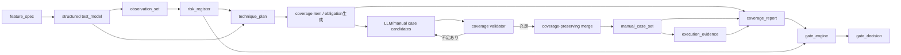
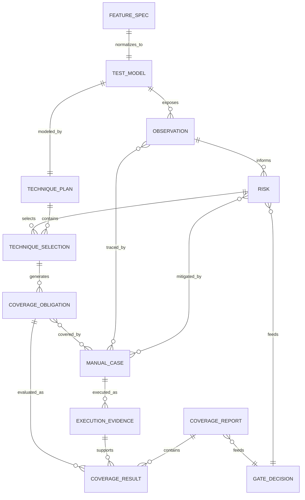
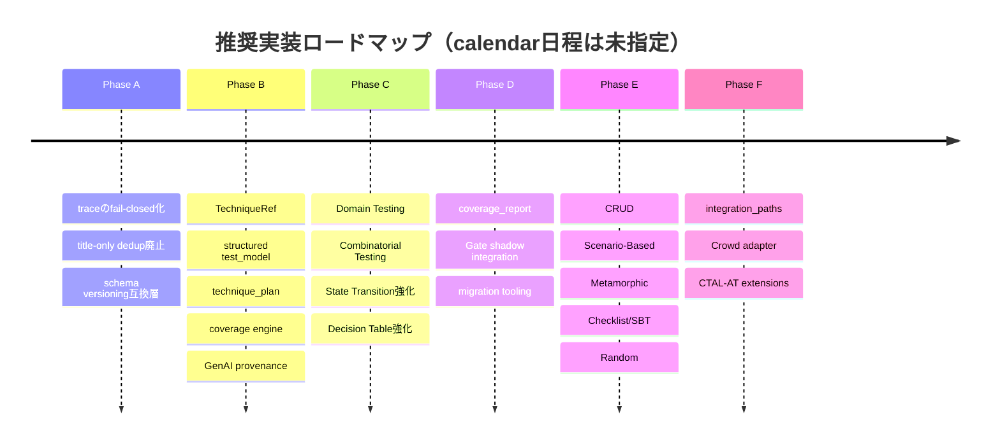

# manual-bb-test-harness 拡張要件定義書

## エグゼクティブサマリ

**結論として、本ハーネスの次期拡張は「テスト技法をプロンプトへ追記する」だけでは不十分です。**  
推奨する中心設計は、現在の

`仕様 → LLM → 観点/ケース → Gate`

から、

**`仕様 → 構造化テストモデル → 技法・網羅基準選択 → coverage item生成 → ケース生成 → 被覆検証 → 被覆を保持した統合 → 実行証跡 → coverage report → Gate`**

へ移行することです。

ISTQB CTAL-TA v4.0 は、Test Analyst向けブラックボックス技法を **Domain / Combinatorial / Random / CRUD / State Transition / Scenario-Based / Decision Table / Metamorphic / Experience-Based** へ整理し、さらにリスクに基づく技法選択とテスト設計自動化を扱っています。特に、自動化されたテスト設計について「テストモデルを作り、モデルからtestwareを生成する」構造を明示しています。CTAL-TA v4.0 は2025年5月公開で、ISTQB公式サイト上でも現行最新版です。citeturn33search0turn37view0turn39view2turn39view3

現行リポジトリでは `test_model` の `data_partitions`、`boundaries`、`rule_columns`、`states`、`valid_transitions` 等がほぼすべて `array[string]` です。この形では、「境界がある」ことは表せても、**どの条件式の、どの境界を、どの精度で、どのcoverage criterionに基づき、どのテストケースが被覆したか**を機械判定できません。fileciteturn5file0L2-L2

さらに、`observation_set.techniques` は8種類の固定enumですが、`manual_case_set.techniques` は任意文字列です。上流・下流で技法の契約が一致していません。fileciteturn6file0L2-L2 fileciteturn7file0L2-L2

優先順位としては、**Domain Testingだけを最初に追加するのではなく、その前に「coverage itemを失わない仕組み」を作るべきです。** 現実装の `_merge_case_sets()` はタイトル文字列だけでケースを重複排除するため、タイトルが同一でもON/OFF点など異なるcoverage itemを持つケースを消せます。また `_link_risks_and_cases()` は意味的に対応するriskが見つからない場合、順番でriskを割り当てるfallbackを持っています。どちらも、正式な技法カバレッジを導入する前に修正すべきです。fileciteturn14file0L1-L18 fileciteturn20file0L8-L16

TesterHomeでも、2026年7月の記事は、AIが自然言語ケースを直接生成する方式より、**AIが構造化モデル候補を作り、境界・組み合わせ・経路・制約・coverage計算を決定的アルゴリズムへ分離する方式**を提案しています。これはCTAL-TA v4.0のテスト設計自動化とかなり整合しています。ただしTesterHomeはコミュニティ情報であり、規範要件ではなく設計判断の補助資料として扱います。citeturn34search0

### 採用すべき変更の要約

| 領域 | 要件 | 優先度 | 粗見積り |
|---|---|---:|---:|
| 被覆基盤 | `TechniqueRef`、`coverage obligation`、`technique_plan`、`coverage_report`を導入 | **高** | 大 |
| 既存不整合 | タイトルだけのdedupを廃止し、coverage-preserving mergeへ変更 | **高** | 中 |
| trace | riskのround-robin自動接続を廃止し、未対応を未対応として残す | **高** | 小〜中 |
| Domain | 条件式、型、精度、border、ON/OFF/IN/OUT、simplified/reliableを構造化 | **高** | 中〜大 |
| Combinatorial | Base Choice、Pairwise、n-wise、制約、実行不能組合せを構造化 | **高** | 大 |
| State | event/guard/action、all transitions、N-switch、round-tripを追加 | **高** | 中〜大 |
| Decision Table | 条件・action・ruleを型付き化し、整合性・完全性・feasibility・checksumを検証 | **高** | 中 |
| Gate | observation実施率とは別にcoverage itemの設計率・実施率を追加 | **高** | 中 |
| GenAI | prompt/model/provenance、grounding、generated-output検証を記録 | **高** | 中 |
| CRUD | entity×function×C/R/U/Dと整合性sequence | 中 | 中 |
| Scenario | main/extension/exception、branch、loopのcoverage | 中 | 中 |
| Metamorphic | source/follow-up/MR/joint evaluation | 中 | 大 |
| Checklist/SBT | checklist版管理、session log、charter強化 | 中 | 小〜中 |
| Random | distribution、seed、budget、exit criterion | 中 | 中 |
| Crowd | 外部tester/environment/evidence受け入れadapter | 低 | 中 |
| CTAL-AT | Example Mapping、heuristics、test tour等 | 低 | 中 |

**暦日・人日見積りは、開発人数、レビュー体制、利用LLM、採用するconstraint solver、CI時間制約が未指定のため本書では確定しません。** 「小/中/大」は変更影響範囲を表します。

## 調査範囲・前提・根拠

### 調査基準

リポジトリは `RNA4219/manual-bb-test-harness` の調査時点のコード、特に以下のSHAを参照して取得したschema、Local Mode、Gate、skill文書を基準にしています。

```text
13100ac69b03cae04d35481870d7f5e6d8f8eb5f
```

たとえば `test_model.schema.json`、`manual_case_set.schema.json`、`local_pipeline.py` はこのSHAの内容を確認しています。fileciteturn5file0L2-L6 fileciteturn7file0L2-L6 fileciteturn12file0L2-L6

調査日基準は **2026-09-10** です。

### 参考資料の優先順位

| 優先 | 資料 | 本書での扱い |
|---|---|---|
| 最優先 | ISTQB公式 CTAL-TA v4.0 | ブラックボックス技法・coverage criterionの規範的基準 |
| 最優先 | ISTQB公式 CTFL v4.0.1 | EP/BVA/Decision Table/State/Experience-Basedの基礎 |
| 最優先 | ISTQB公式 CT-GenAI v1.1 | LLM利用時のprompt、output evaluation、hallucination/bias/privacy等 |
| 最優先 | 当該GitHubリポジトリ | 現行実装・契約の正本 |
| 補助 | CTAL-AT v2.0 | Example Mapping、heuristics、test tours等の将来拡張 |
| 補助 | TesterHome | AI/MBT/複合環境テストの実務的設計事例。非規範 |

CTFLについて、ISTQB公式配布ページには現在 `CTFL Syllabus v4.0.1` が掲載されています。CTAL-TAはv4.0が現行最新版です。CT-GenAIは2026年にv1.1へminor updateされ、構造・Learning Objectives・全体scope自体はv1.0から変更されず、evaluation metrics、リスク関連記述、LLM-powered agents等が補足されています。citeturn28search3turn33search0turn32view0

CTAL-AT v2.0は2026年5月公開で、heuristics、mnemonics、test tours、example mapping、cognitive bias等が追加されています。これらは本ハーネスのReadyフェーズやexploratory charterへの将来拡張候補とします。citeturn40search0turn40search1

### 前提と未指定事項

| 項目 | 本書での扱い |
|---|---|
| 主対象 | 現行設計に合わせ、manual black-box/system・acceptance寄りのテスト設計を主対象とする |
| 対象SUTの業種 | **未指定** |
| AI-based SUT自体をテストするか | **未指定**。本書ではLLMを「テスト支援に使う」CT-GenAIを主対象とし、CT-AI v2.0は別profile候補とする。ISTQBもCT-AIとCT-GenAIを別資格として扱っている。citeturn40search5 |
| 新しいGate coverage閾値 | **未指定** |
| Domain/constraint式の実装ライブラリ | **未指定** |
| Pairwise/n-wise生成ライブラリ | **未指定** |
| SAT/SMT solverの採用 | **未指定** |
| Random PRNG実装 | **未指定** |
| LLM provider/model | **未指定** |
| LLM seedの利用可否 | **未指定** |
| 人間reviewerの役割・承認フロー | **未指定** |
| Crowd testing vendor/platform | **未指定** |
| retention/audit期間 | **未指定** |
| 新schemaの正式version番号 | **未指定**。本書中の `1.1.0` は例示 |
| 開発人数、人日、calendar schedule | **未指定** |
| 既存外部consumerの一覧 | **未指定** |

現在の `feature_spec` はAC、business rules、source refs、assumptionsを持つため、新しい構造化モデルを導出する入力としては利用できます。ただしACやbusiness rule自体は文字列であり、式やparameterへ正規化する新工程が必要です。fileciteturn31file0L2-L12

### 現状で維持すべき設計

既存設計には捨てるべきでない要素も多くあります。`case-design-policy.md` は、ケースへ直行せずcoverage itemを先に抽出すること、EP、3-value BVA、decision table、state transition、exploratory testing、二重操作、recovery、mobile contextを考慮することを既に要求しています。さらに複数dimensionではPairwiseから始める方針、derived oracleとしてmetamorphic relationを使う方針もあります。fileciteturn10file0L2-L2

したがって、本拡張は既存思想の置換ではなく、**自然言語方針を型付きartifactと決定的検証へ昇格させる変更**とします。

## 技法ギャップと拡張データモデル

### 追加・形式化する技法

CTAL-TA v4.0はData-BasedとしてDomain、Combinatorial、Random、Behavior-BasedとしてCRUD、State Transition、Scenario-Based、Rule-BasedとしてDecision Table、Metamorphicを扱います。経験ベースではSession-Based向けcharter、checklist、crowd testingまで含みます。citeturn37view0turn38view0turn38view3turn38view4turn38view5turn38view6turn39view0turn39view1

| ISTQB識別子 | 技法 | 現状 | 必須データ要素 |
|---|---|---|---|
| **TA-3.1.1** | Domain Testing | **新規形式化**。現行`boundaries[string]`では不十分 | `parameter_id`、型、単位、精度/step、partition predicate、border ID、operator、open/closed、対象variables、constraint、criterion=`simplified/reliable`、point role=`ON/OFF/IN/OUT`、具体値、feasibility |
| **TA-3.1.2** | Combinatorial Testing | **部分対応**。文書にPairwiseあり、データ契約なし | parameters、values/classes、constraints、infeasible combinations、criterion=`base_choice/pairwise/n_wise/all`、strength、base choice、generator/version、feasible denominator |
| **TA-3.1.3** | Random Testing | **新規** | input domain、probability distribution、guided/unguided、seed、sample budget、time budget、oracle、duplicate policy、exit criterion |
| **TA-3.2.1** | CRUD Testing | **新規** | entity、function、C/R/U/D matrix、required operations、negative sequence、consistency sequence、read paths |
| **TA-3.2.2** | State Transition Testing | **強化** | state ID、transition ID、from/to、event、guard、action、valid/invalid、criterion=`all_states/valid_transitions/all_transitions/n_switch/round_trip`、N |
| **TA-3.2.3** | Scenario-Based Testing | **部分対応**。`use_case/user_scenario`あり | scenario ID、main/extension/exception、nodes/edges、branch、join、loop、loop bound、scenario coverage item |
| **TA-3.3.1** | Decision Table Testing | **強化** | condition IDs/values、actions、full rules、feasible flag、minimized rule、represented rule IDs、overlap、consistency/completeness/correctness、checksum |
| **TA-3.3.2** | Metamorphic Testing | **部分対応**。oracle文書に記述あり | MR ID、source constraints、input transformation、expected relation、source case、follow-up cases、joint result、trial budget |
| **TA-3.4.1** | Test Charter / Session-Based | **強化** | mission、scope、resources、information sought、entry/exit criteria、environment、limitations、history、session log、findings |
| **TA-3.4.2** | Checklist-Based | **新規形式化** | checklist ID/version、scope、objective、source、category、item ID、question、priority、applicability、result、revision reason |
| **TA-3.4.3** | Crowd Testing | **新規・低優先** | campaign、tester cohort、environment/device/network、security constraints、duplicate grouping、evidence quality、report ID |
| CTFL §4.4.1 | Error Guessing | **既存強化** | `basis_refs`として過去bug、障害、類似system failure、fault taxonomyを明示 |
| CTFL §4.2.1/4.2.2 | EP/BVA | **既存維持** | Domainへの入力としてpartition ID、boundary IDを永続ID化 |

CTFL v4.0.1ではEPのcoverage itemはpartitionであり、BVAは2-valueと3-valueを区別します。3-value BVAはboundaryとその両隣をcoverage itemとします。したがって、現行の `boundary3` 方針は残せますが、Domain TestingのON/OFF/IN/OUTと同一概念として潰してはいけません。citeturn39view4

### Domain Testingの要件

Domain Testingは単一inputのmin/maxテストの別名ではありません。CTAL-TAでは、複数parameterや複雑なpartitionへEP/BVAを一般化し、Boolean条件式を構成するatomic conditionごとにborderを扱います。`<, >, !=` はopen border、`<=, >=, =` はclosed borderとして扱われ、指定された精度に基づいてON/OFF点を配置します。citeturn38view0

Simplified Domain Coverageでは、通常の `<, <=, >, >=` borderごとにON/OFFが必要です。Reliable Domain CoverageではさらにIN/OUTを要求します。`=` と `!=` は両側に点を必要とする特別な規則があります。citeturn38view1

例えば以下を正式に扱える必要があります。

```text
P: integer, JPY, step=1
D: integer, JPY, step=1

partition:
    P - D >= 5000

constraints:
    P >= 0
    D >= 0
    D <= P
```

```json
{
  "id": "DOM-DISCOUNT-01",
  "variables": ["P", "D"],
  "partition_predicate": {
    "op": "gte",
    "args": [
      {
        "op": "sub",
        "args": [{"var": "P"}, {"var": "D"}]
      },
      {"const": 5000}
    ]
  },
  "borders": [
    {
      "id": "BORDER-DISCOUNT-01",
      "operator": ">=",
      "closed": true,
      "criterion": "reliable_domain"
    }
  ]
}
```

`P=6000` をanchorとすれば、step=1の例では `D=1000` がON、`D=1001` がOFFになります。Reliable criterionなら、別途IN/OUTを配置します。**ケースタイトルではなく `BORDER-DISCOUNT-01:ON` のようなcoverage item IDで追跡すること**を要件とします。これはISTQBのcoverage item概念を本ハーネスで永続ID化する設計です。citeturn38view0turn38view1

### Combinatorial・Random・CRUD

Combinatorial Testingでは、CTAL-TA v4.0がBase ChoiceとPairwiseを具体的coverage criteriaとして説明しており、constraintやinfeasible combinationが最終ケース数へ影響することも明記しています。高リスクではPairwiseより強いcoverage criterionが適切になり得ます。citeturn38view2turn39view2

現行文書には「multiple data dimensionsはPairwiseから開始」とありますが、parameter/value/constraint/feasible pairの構造が存在しません。したがって、Pairwiseは「未着想」ではなく**方針のみ存在し、実行可能な契約が不足**という判定です。fileciteturn10file0L2-L2

Random Testingには認知されたcoverage percentage criterionがなく、実行件数や時間などをexit criterionとして扱う点が重要です。したがって、Randomを無理に「100% coverage」に変換してはいけません。指定probability distribution、guided/unguided、budgetを保存します。citeturn38view2

CRUDではentity lifecycleに対するC/R/U/D completenessと、複数functionをまたぐconsistencyを区別します。さらに「create前read」のようなnegative sequence、更新後に各read経路で整合性を確認するような強化criteriaも扱える構造にします。citeturn38view3

### State・Scenario・Decision Table・Metamorphic

State modelでは、文字列 `"pending -> cancelled"` だけではなく、transition triggerとなるevent、guard、actionを保持します。CTAL-TAはvalid transitionである0-switchに加えて、N+1個の連続transitionを対象にするN-switch、loopを対象にするround-tripを追加しています。citeturn38view4

CTFLでも `all states < valid transitions < all transitions` の強さの違いが明示されており、all transitionsではinvalid transitionを実際に試す必要があります。citeturn39view5

Scenario-Based Testingではmain scenario、extension/alternative、exceptionを区別し、loopがある場合は0回、1回、複数回、可能なら最大回数をcoverage candidateとして扱います。citeturn27view0

Decision Tableは、単にrule列を文字列で列挙するだけでなく、consistency、feasibility、completeness、correctness、rule overlapを検査し、minimization時にはoriginal rulesとの等価性を検証できる必要があります。CTAL-TAはchecksum procedureも提示しています。coverage denominatorはfeasible columnsです。citeturn38view5

Metamorphic Testingではsource testとfollow-up testを個別にpassさせるだけでは完了ではなく、**metamorphic relationをjoint evaluationするtest procedure**が必要です。また「MRを各1回実行した」というだけでは有用なexit criterionにならないため、trial/budgetを別管理します。citeturn38view6

### Experience-BasedとTesterHome由来の拡張

現在のexploratory charterには `scope`、`questions`、`estimate_minutes` はありますが、session result/log、entry/exit criteria、limitations、environmentなどはありません。fileciteturn7file0L2-L2

CTAL-TAではcharterにmission、scope、resources、entry criteria、environment、limitations、historical information等を持たせ、session中のquestion、observation、future idea、resultをsession sheetへ記録する考え方があります。citeturn38view7turn39view0

Checklist-Based Testingについては、項目を独立かつ直接確認可能にし、過去defectやriskなどを基に作成し、継続的に改訂することが推奨されています。citeturn39view0turn39view6turn39view7turn39view8

TesterHomeの2026年9月記事は、複数端末・cloud・network・OTAを持つsystemでは機能単位だけでなく**端末間のend-to-end path**でテストを分解する実務例を示しています。これはISTQB技法そのものではありませんが、現行 `regression_edges` と `platform_matrix` を `integration_paths` として構造化する補助要件に採用する価値があります。citeturn36view0

推奨追加項目は以下です。

```json
{
  "integration_paths": [
    {
      "id": "PATH-01",
      "endpoints": ["mobile_app", "cloud_api", "device"],
      "states": ["connected", "syncing", "recovered"],
      "version_dimensions": ["app_version", "device_fw"],
      "environment_dimensions": ["network", "permission"],
      "failure_modes": ["timeout", "partial_sync", "version_mismatch"],
      "recovery_requirements": ["retry", "state_resync"]
    }
  ]
}
```

これは **TesterHome由来の実務拡張であり、ISTQB必須技法とは扱いません。**

## ターゲットアーキテクチャとスキーマ契約

### 推奨ワークフロー

CTAL-TAはテスト設計自動化においてtest modelを作り、それからtestwareを生成する方式を説明しています。またTesterHomeの関連記事も、AIをsemantic modelingへ、coverage/combination/path生成をdeterministic algorithmへ分ける方式を提案しています。citeturn39view3turn34search0



ここで本書の **coverage obligation** はISTQBのcoverage itemを実装上の永続IDとして管理する名称です。

LLMは次の仕事を担当します。

```text
仕様の意味理解
→ rule/parameter/state/scenario候補抽出
→ sourceとのtrace候補
→ human-readable caseのrendering
```

決定的コード側は次を担当します。

```text
border point生成
pairwise/n-wise生成
state path列挙
decision table検査
coverage計算
constraint検査
trace整合性
case merge時のcoverage保存確認
```

### Artifact関係



### 共通schemaの変更

現在の `shared_defs.schema.json` にはSourceRef、Assumption、Oracle、Priority、TestView、GateStatus等があります。技法自体を共有する定義はありません。fileciteturn29file0L2-L2

以下を追加します。

```json
{
  "$defs": {
    "TechniqueRef": {
      "type": "object",
      "required": ["key", "standard", "reference"],
      "properties": {
        "key": {
          "enum": [
            "equivalence_partitioning",
            "boundary_value_analysis",
            "domain_testing",
            "combinatorial_testing",
            "random_testing",
            "crud_testing",
            "state_transition_testing",
            "scenario_based_testing",
            "decision_table_testing",
            "metamorphic_testing",
            "exploratory_testing",
            "error_guessing",
            "checklist_based_testing",
            "crowd_testing"
          ]
        },
        "standard": {
          "type": "string"
        },
        "reference": {
          "type": "string"
        },
        "criterion": {
          "type": "string"
        },
        "legacy_alias": {
          "type": "string"
        }
      },
      "additionalProperties": false
    },

    "CoverageObligation": {
      "type": "object",
      "required": [
        "id",
        "technique_key",
        "model_ref",
        "criterion",
        "required",
        "feasibility"
      ],
      "properties": {
        "id": {"type": "string"},
        "technique_key": {"type": "string"},
        "model_ref": {"type": "string"},
        "criterion": {"type": "string"},
        "selector": {"type": "object"},
        "required": {"type": "boolean"},
        "feasibility": {
          "enum": ["feasible", "infeasible", "unknown"]
        },
        "observation_ids": {
          "type": "array",
          "items": {"type": "string"}
        },
        "risk_ids": {
          "type": "array",
          "items": {"type": "string"}
        },
        "source_refs": {
          "type": "array",
          "items": {"$ref": "#/$defs/SourceRef"}
        }
      },
      "additionalProperties": false
    }
  }
}
```

### 式を文字列だけにしない

条件式を任意Python式として `eval()` する実装は禁止します。安全性と再現性のため、制限されたAST形式を要求します。

```json
{
  "ExprNode": {
    "oneOf": [
      {
        "type": "object",
        "required": ["var"],
        "properties": {
          "var": {"type": "string"}
        },
        "additionalProperties": false
      },
      {
        "type": "object",
        "required": ["const"],
        "properties": {
          "const": {}
        },
        "additionalProperties": false
      },
      {
        "type": "object",
        "required": ["op", "args"],
        "properties": {
          "op": {
            "enum": [
              "and", "or", "not",
              "eq", "neq", "lt", "lte", "gt", "gte",
              "add", "sub", "mul", "div"
            ]
          },
          "args": {
            "type": "array"
          }
        },
        "additionalProperties": false
      }
    ]
  }
}
```

具体的なexpression engineまたはsolverの採用製品は **未指定** とします。

### `test_model.schema.json` 差分

現状フィールドを即削除すると互換性を壊すため、まずadditive changeとします。

| 現行 | 追加 | 用途 |
|---|---|---|
| `data_partitions: string[]` | `parameters[]`, `domain_models[]` | EP/BVA/Domainの型付きモデル |
| `boundaries: string[]` | `domain_models[].borders[]` | border identity、operator、精度 |
| `rule_columns: string[]` | `decision_tables[]` | full/minimized rules |
| `states: string[]` | `state_models[].states[]` | typed states |
| `valid_transitions/invalid_transitions` | `state_models[].transitions[]` | event/guard/action込み |
| `flows: string[]` | `scenario_models[]` | main/extension/exception/loop |
| なし | `combination_models[]` | Base Choice/Pairwise/n-wise |
| なし | `random_models[]` | distribution/budget |
| なし | `crud_models[]` | entity lifecycle |
| なし | `metamorphic_relations[]` | MR |
| `regression_edges` | `integration_paths[]` | end-to-end path |
| `quality_lenses` | 維持 | techniqueとは別概念として維持 |

現在のフィールドがすべて文字列配列中心であることは現行schemaで確認できます。fileciteturn5file0L2-L2

Domain部分の具体的schema要求は以下です。

```json
{
  "properties": {
    "parameters": {
      "type": "array",
      "items": {
        "type": "object",
        "required": ["id", "name", "type"],
        "properties": {
          "id": {"type": "string"},
          "name": {"type": "string"},
          "type": {
            "enum": [
              "integer",
              "number",
              "decimal",
              "string",
              "boolean",
              "enum",
              "date",
              "datetime"
            ]
          },
          "unit": {"type": "string"},
          "precision": {"type": "integer", "minimum": 0},
          "step": {
            "oneOf": [
              {"type": "number", "exclusiveMinimum": 0},
              {"type": "string"}
            ]
          }
        },
        "additionalProperties": false
      }
    },

    "domain_models": {
      "type": "array",
      "items": {
        "type": "object",
        "required": [
          "id",
          "variable_ids",
          "partition_predicate",
          "borders",
          "coverage_criterion"
        ],
        "properties": {
          "id": {"type": "string"},
          "variable_ids": {
            "type": "array",
            "items": {"type": "string"}
          },
          "partition_predicate": {
            "$ref": "shared_defs.schema.json#/$defs/ExprNode"
          },
          "constraints": {
            "type": "array",
            "items": {
              "$ref": "shared_defs.schema.json#/$defs/ExprNode"
            }
          },
          "coverage_criterion": {
            "enum": ["simplified_domain", "reliable_domain"]
          },
          "borders": {
            "type": "array",
            "items": {
              "type": "object",
              "required": ["id", "operator"],
              "properties": {
                "id": {"type": "string"},
                "operator": {
                  "enum": ["<", "<=", "=", "!=", ">=", ">"]
                },
                "closed": {"type": "boolean"}
              }
            }
          }
        }
      }
    }
  }
}
```

### 新規 `technique_plan.schema.json`

技法の存在と「なぜ選んだか」を分離します。CTAL-TAはtest objective、product risk、test basis、recurring defect type、tester knowledge、lifecycle、contract/regulatory/project constraintなどを技法選択要因として扱います。citeturn39view2turn39view3

```json
{
  "feature_id": "ORD-CANCEL-01",
  "selections": [
    {
      "id": "TECH-DOM-01",
      "technique": {
        "key": "domain_testing",
        "standard": "ISTQB CTAL-TA v4.0",
        "reference": "TA-3.1.1",
        "criterion": "reliable_domain"
      },
      "status": "selected",
      "rationale": "金額境界の実装誤りがP1リスクであるため",
      "model_refs": ["DOM-PRICE-01"],
      "risk_ids": ["RISK-03"],
      "observation_ids": ["OBS-DATA-02"]
    }
  ],
  "obligation_sets": [
    {
      "id": "COVSET-DOM-01",
      "representation": "explicit",
      "obligations": [
        {
          "id": "COV-DOM-B1-ON",
          "technique_key": "domain_testing",
          "model_ref": "DOM-PRICE-01",
          "criterion": "reliable_domain",
          "selector": {
            "border_id": "BORDER-01",
            "point_role": "ON"
          },
          "required": true,
          "feasibility": "feasible"
        }
      ]
    }
  ]
}
```

`status` は最低でも次を許可します。

```text
selected
not_applicable
deferred
blocked_by_missing_information
```

**技法が無いことと、検討した結果不適用にしたことを区別する**ためです。

Combinatorialのobligation数が大きくなる場合は、全tupleをJSONへ展開せず、

```text
representation = symbolic
generator_id
generator_version
model_hash
constraint_hash
criterion
strength
```

を保存し、coverage engineが同じ集合を再計算できるようにします。

### `observation_set` と `manual_case_set`

`observation_set.techniques` の固定enumと `manual_case_set.techniques` の自由文字列という現行不一致を解消します。fileciteturn6file0L2-L2 fileciteturn7file0L2-L2

移行期間は既存 `techniques` を残し、新しく共通型を追加します。

```json
{
  "techniques": ["boundary_value"],
  "technique_refs": [
    {
      "key": "domain_testing",
      "standard": "ISTQB CTAL-TA v4.0",
      "reference": "TA-3.1.1",
      "criterion": "simplified_domain"
    }
  ]
}
```

`ManualTestCase` には次を追加します。

```json
{
  "coverage_obligation_ids": [
    "COV-DOM-B1-ON",
    "COV-DOM-B1-OFF"
  ],
  "test_data": [
    {
      "parameter_id": "P",
      "value": 6000,
      "unit": "JPY"
    },
    {
      "parameter_id": "D",
      "value": 1000,
      "unit": "JPY",
      "coverage_role": {
        "border_id": "BORDER-DISCOUNT-01",
        "point_role": "ON"
      }
    }
  ]
}
```

**`coverage_obligation_ids` はケース生成LLMが自由に宣言するだけではcoverage成立と認めません。** coverage engineが入力値、path、rule等から再検証します。

### `execution_evidence` と `coverage_report`

現在の `execution_evidence` はcase/charter単位でpass/fail等を記録しますが、coverage obligationやmetamorphic relationのaggregate resultは持ちません。fileciteturn28file0L2-L2

追加案:

```json
{
  "coverage_obligation_ids": [
    "COV-DOM-B1-ON"
  ],
  "relation_evaluation": {
    "relation_id": "MR-01",
    "group_run_id": "MRRUN-42",
    "source_run_id": "RUN-10",
    "follow_up_run_ids": ["RUN-11", "RUN-12"],
    "result": "pass"
  }
}
```

新規 `coverage_report.schema.json`:

```json
{
  "feature_id": "ORD-CANCEL-01",
  "build_id": "BUILD-42",

  "design": {
    "required_feasible": 30,
    "covered_by_cases": 29,
    "rate": 96.67,
    "uncovered_ids": ["COV-STATE-SW1-04"]
  },

  "execution": {
    "required_feasible": 30,
    "executed": 27,
    "rate": 90.0,
    "unexecuted_ids": [
      "COV-STATE-SW1-04",
      "COV-DOM-B3-OFF",
      "COV-DT-RULE-08"
    ]
  },

  "exit_criteria": [
    {
      "model_ref": "RANDOM-01",
      "metric_kind": "budget",
      "required": 500,
      "actual": 500,
      "status": "met"
    }
  ]
}
```

ここで、

```text
designed
executed
passed
```

を混同しません。

失敗したcaseも「実施済み」には数えます。現行Gateのmandatory observation rateもpass/failを「実行済み」として扱っているため、この意味は維持できます。fileciteturn25file0L2-L2

### Gate contract

現在の `gate_decision.evidence_summary` は、

```text
manual_by_priority
mandatory_observation_rate
```

のみです。fileciteturn8file0L2-L2

追加します。

```json
{
  "evidence_summary": {
    "manual_by_priority": {},
    "mandatory_observation_rate": 100,

    "required_obligation_design_rate": 100,
    "required_obligation_execution_rate": 96.7,
    "coverage_exit_criteria_met": true,
    "coverage_report_id": "COVREPORT-42"
  }
}
```

本番Gateで要求する具体的coverage thresholdは **未指定** とします。

移行初期は、

```text
compatibility mode:
    新metricはreport only

enhanced mode:
    new coverage thresholdをGate判定へ使用
```

の二段階とします。

### GenAI provenance contract

CT-GenAI v1.1では、prompt engineering、AI-generated outputの評価、hallucination、bias、data privacy、LLM-powered tools/agentsなどが引き続き主要テーマです。v1.1はLearning Objectiveの構造自体を変更していません。citeturn32view0turn29search2

ISTQBが次のフィールド名を直接要求しているわけではありませんが、本ハーネス向けに次のように具体化します。

```json
{
  "generation": {
    "generation_run_id": "GEN-20260910-001",
    "prompt_template_id": "case-generation",
    "prompt_template_version": "3",
    "input_sha256": "...",
    "output_schema_id": "manual_case_set.schema.json",
    "model": {
      "provider": "未指定",
      "name": "未指定",
      "version": "未指定"
    },
    "parameters": {
      "temperature": null,
      "seed": null
    },
    "generated_at": "2026-09-10T10:00:00+09:00",
    "review_status": "pending"
  }
}
```

provider/model/version/seedがruntimeから取得できない場合は、値を創作せず `null` または `"unknown"` とします。

## 機能要件・優先度・実装ロードマップ

### 実行可能な機能要件

| 要件ID | 要件 | 優先度 | 見積り | 主根拠 |
|---|---|---:|---:|---|
| **FR-CORE-TRACE** | caseとrisk/observationを意味的根拠なく自動接続してはならない。未対応はuncoveredとして出力する | 高 | 小〜中 | 現行round-robin fallback fileciteturn20file0L8-L16 |
| **FR-CORE-MERGE** | mergeは各ケースが持つcoverage obligationを失わないことを機械検証する | 高 | 中 | 現行title-only dedup fileciteturn14file0L1-L18 |
| **FR-CORE-TECH** | 技法名、ISTQB参照、criterionを共通`TechniqueRef`で管理する | 高 | 中 | 現行schema不一致 fileciteturn6file0L2-L2 fileciteturn7file0L2-L2 |
| **FR-CORE-COV** | technique modelからcoverage obligationsを決定的に生成し、case mappingを検証する | 高 | 大 | CTAL-TA automation citeturn39view3 |
| **FR-DOM** | TA-3.1.1 simplified/reliable Domain Coverageを生成・検証する | 高 | 中〜大 | citeturn38view0turn38view1 |
| **FR-COMB** | Base Choice、Pairwise、configurable n-wiseとconstraintを扱う | 高 | 大 | citeturn38view2turn39view2 |
| **FR-STATE** | event/guard/action、all transitions、N-switch、round-tripを扱う | 高 | 中〜大 | citeturn38view4turn39view5 |
| **FR-DTABLE** | full/minimized decision table、feasibility、overlap、checksumを検証する | 高 | 中 | citeturn38view5 |
| **FR-GATE-COV** | observation rateと別にdesign/execution coverageをGateへ入力する | 高 | 中 | 現行Gate fileciteturn25file0L2-L2 |
| **FR-GENAI-PROV** | generation provenance、prompt version、input hash、review statusを保存する | 高 | 中 | CT-GenAI v1.1 citeturn32view0 |
| **FR-GENAI-GROUND** | specified oracle/sourceを生成する場合、実在source refを必須とし、発明したrefをfailさせる | 高 | 小〜中 | 既存lint方向性 fileciteturn12file0L2-L2 |
| **FR-CRUD** | entity×function×CRUD completeness/consistencyを計算する | 中 | 中 | citeturn38view3 |
| **FR-SCENARIO** | main/extension/exceptionとloop coverageを生成する | 中 | 中 | citeturn27view0 |
| **FR-META** | MR source/follow-up/joint evaluationを一体で管理する | 中 | 大 | citeturn38view6 |
| **FR-RANDOM** | distribution/seed/budget/exit criterionを管理し、percentage coverageを捏造しない | 中 | 中 | citeturn38view2 |
| **FR-CHECKLIST** | checklist version/source/item/result/revisionを管理する | 中 | 小〜中 | citeturn39view0turn39view8 |
| **FR-SBT** | charter/session logをCTAL-TA相当に拡張する | 中 | 小〜中 | citeturn38view7turn39view0 |
| **FR-PATH** | multi-end system向けintegration pathをregression/platform dimensionに追加 | 中 | 中 | TesterHome citeturn36view0 |
| **FR-CROWD** | crowd execution evidenceを外部adapterとして受け入れる | 低 | 中 | citeturn39view1 |
| **FR-AGILE** | Example Mapping、heuristics、test toursをReady/charterへ追加可能にする | 低 | 中 | CTAL-AT v2.0 citeturn40search0 |

### API・Python contract

外部HTTP APIの提供方式は **未指定** です。本要件で必須とするAPIはまずpackage内部Python APIとJSON artifact contractです。

新規モジュール候補:

```python
# src/bb_harness/coverage_engine.py

def build_technique_plan(
    feature_spec: dict,
    test_model: dict,
    observations: dict,
    risks: dict,
) -> dict:
    """選択技法、coverage criterion、適用理由を返す。"""


def enumerate_coverage_obligations(
    test_model: dict,
    technique_plan: dict,
) -> list[dict]:
    """決定的にcoverage item集合を生成する。"""


def validate_case_coverage(
    manual_case_set: dict,
    test_model: dict,
    technique_plan: dict,
) -> dict:
    """各caseが宣言したcoverage itemを実際に満たすか検証する。"""


def build_coverage_report(
    obligations: list[dict],
    manual_case_set: dict,
    execution_evidence: list[dict] | None = None,
) -> dict:
    """設計coverageと実施coverageを別々に算出する。"""
```

技法別実装候補:

```text
src/bb_harness/techniques/domain.py
src/bb_harness/techniques/combinatorial.py
src/bb_harness/techniques/state_transition.py
src/bb_harness/techniques/decision_table.py
src/bb_harness/techniques/crud.py
src/bb_harness/techniques/scenario.py
src/bb_harness/techniques/metamorphic.py
src/bb_harness/techniques/random_testing.py
```

### 実装順



**Phase AをDomain実装より前に置くことを必須とします。**

理由は、現状では新しく生成したON/OFFケースが同じタイトルならmerge時に消える可能性があるためです。さらに、risk traceを意味なく補修してしまうとcoverage gapを正確に報告できません。fileciteturn14file0L1-L18 fileciteturn20file0L8-L16

また `SKILL.md` ではmulti-runのmergeについて `normalized_title + technique + trace_to` が言及されていますが、実装側はtitleだけの`seen_titles`を使用しており、文書と実装にも差があります。fileciteturn13file1L13-L22 fileciteturn14file0L8-L16

## 受け入れ・回帰・移行・コード変更

### 自動検証可能な受け入れ基準

| TC ID | 対象 | 入力・条件 | 合格条件 |
|---|---|---|---|
| **TC-DOM-CLOSED** | Domain | `x >= 10`, integer, step=1, simplified | `ON=10`, `OFF=9` のobligationが生成される |
| **TC-DOM-OPEN** | Domain | `x > 10`, integer, step=1, simplified | `ON=11`, `OFF=10` が生成される |
| **TC-DOM-NEQ** | Domain | `x != 10`, step=1 | `OFF=10` と両側のON `9/11` を要求する |
| **TC-DOM-RELIABLE** | Domain | `x >= 10`, reliable | ON/OFFだけではcompleteにならずIN/OUTも必要 |
| **TC-DOM-PRECISION** | Domain | decimal, step=0.1 | border隣接点を±1で作らず、step=0.1に従う |
| **TC-COMB-CONSTRAINT** | Pairwise | infeasible combinationを含む | infeasible pairをdenominatorから除外し、すべてのfeasible pairを被覆 |
| **TC-COMB-GAP** | Pairwise | 1 pairだけ欠落 | 欠落tupleのobligation IDを明示する |
| **TC-STATE-0SW** | State | 全valid transitionを別々のcaseで実行 | 0-switch=100%になり得る |
| **TC-STATE-1SW** | State | 上記だが連続pairを実行していない | 1-switchは100%にならず、missing sequenceを示す |
| **TC-STATE-INVALID** | State | invalid transition未実施 | all-transitions criterionでは未被覆 |
| **TC-SCENARIO-LOOP** | Scenario | max loop=3 | 0回、1回、>1回、最大回数の要求を区別する |
| **TC-DT-CONFLICT** | Decision | 同一condition combinationで異なるactions | consistency error |
| **TC-DT-INFEASIBLE** | Decision | infeasible rule | coverage denominatorへ含めない |
| **TC-DT-MIN** | Decision | minimized table | original feasible rulesとの対応を失う場合fail |
| **TC-CRUD-NEG** | CRUD | create前read | negative obligationとして生成 |
| **TC-CRUD-U-R** | CRUD | update後に複数read経路 | 必須read経路の1つが欠ければconsistency incomplete |
| **TC-META-JOINT** | Metamorphic | source/follow-upが個別pass、joint resultなし | MR coverageをcompleteにしない |
| **TC-RANDOM-SEED** | Random | 同一seed/model | deterministic generatorなら同一sequenceを再生成 |
| **TC-RANDOM-EXIT** | Random | budget 500/actual 499 | coverage%ではなくexit criterion未達とする |
| **TC-MERGE-SAME-TITLE** | Merge | 同一title、片方ON、片方OFF | 両coverage itemを保持する。統合可能なら統合後caseが両方を満たす |
| **TC-RISK-NOMAP** | Trace | caseとriskの意味的対応なし | round-robin接続せずunmappedとして残す |
| **TC-OBS-VS-COV** | Gate | OBS-01を1case実行、OBS配下4 obligations中1だけ実行 | observation rateとobligation rateを別値で出す |
| **TC-EXEC-FAIL** | Coverage | required obligationのcaseがfail | execution coverageには算入するがpassとはしない |
| **TC-GENAI-ORACLE** | GenAI | 存在しないACをspecified oracleとして出力 | semantic validation fail |
| **TC-GENAI-PROV** | GenAI | enhanced modeでprompt version/input hashなし | policyに応じvalidation error |
| **TC-SCHEMA-LEGACY** | Migration | 現行artifact | new readerのcompat modeで読み取り成功 |
| **TC-MIG-IDEMPOTENT** | Migration | 同artifactを2回migration | 2回目に意味的変更が発生しない |
| **TC-SCHEMA-MIRROR** | Packaging | root schemaとpackage schema | 対応schemaのsemantic/hash同一性をCIで検証 |

Domainの最初の4ケースはCTAL-TA v4.0のopen/closed borderおよびSimplified/Reliable criteriaに対応します。citeturn38view0turn38view1

State、Scenario、Decision、Metamorphicの判定はそれぞれ公式criteriaに対応します。citeturn38view4turn27view0turn38view5turn38view6

Randomの終了条件は、認知されたcoverage criterionがないというCTAL-TAの扱いに合わせます。citeturn38view2

### 回帰テスト方針

既存CIは全体pytest coverage 85%以上、Gate関連についてbranch coverage 90%以上を要求しています。新しいcoverage engineも、少なくともGate相当の重要ロジックについてbranch coverage 90%以上を推奨要件とします。既存値自体はリポジトリのworkflowで確認できます。fileciteturn30file4L75-L90

既存テストでは `tests/test_local_pipeline.py`、`tests/test_gate_v2.py`、`tests/test_evaluate_gate.py` が変更影響を受けます。fileciteturn4file10L116-L127 fileciteturn30file1L26-L40 fileciteturn30file3L58-L72

新規候補:

```text
tests/test_coverage_engine.py
tests/test_technique_domain.py
tests/test_technique_combinatorial.py
tests/test_technique_state_transition.py
tests/test_technique_decision_table.py
tests/test_technique_crud.py
tests/test_technique_scenario.py
tests/test_technique_metamorphic.py
tests/test_technique_random.py
tests/test_schema_compatibility.py
tests/test_artifact_migration.py
tests/test_schema_mirror.py
```

### 互換性方針

現在のschemaの多くは `additionalProperties: false` です。したがって、新フィールドを持つartifactを古いvalidatorへ渡すとforward compatibilityを保証できません。fileciteturn5file0L2-L2 fileciteturn6file0L2-L2 fileciteturn7file0L2-L2

そのため互換性は次のように定義します。

| 方向 | 方針 |
|---|---|
| **新reader → 旧artifact** | 必須対応。legacy artifactを正規化して読み込む |
| **旧reader → 新artifact** | 原則保証しない |
| 旧consumerが残る期間 | `--artifact-version legacy` で新フィールドを除いた出力を提供 |
| 旧`techniques` string | 保持しつつ `technique_refs` へ変換 |
| 旧`boundaries[string]` | `legacy_unstructured`として保存。正式なDomain Coverage達成とは見なさない |
| 旧`rule_columns[string]` | legacy representationとして保持。Decision Table完全性を自動主張しない |
| 旧state strings | typed stateへのmigration候補を生成するが、推測は`needs_review` |
| 旧case | obligation mappingを安全に導出できない場合 `unmapped`。coveredと推測しない |
| 旧observation | ID・mandatoryを保持し、technique aliasのみ変換 |
| 旧Gate | compatibility modeでは現在の判定を維持 |
| 新coverage metric | 初期はshadow/report-only |
| waiver | 既存risk waiverを維持。coverage gapからwaiverを自動生成しない |

現行artifact contractでもGate入力は明示的schema検証やwaiverの明示管理を重視しています。新coverage gapについても同じfail-closed原則を維持します。fileciteturn26file0L2-L2

### 移行手順

**移行は破壊的更新を禁止します。**

1. `schema_version` または `artifact_meta.schema_version` を全artifactへoptionalで追加します。正式なversion番号は **未指定** とし、例として `1.1.0` を使用します。

2. `shared_defs`、`test_model`、`observation_set`、`manual_case_set` に新フィールドをoptional追加します。既存required fieldを第一段階では変更しません。

3. `migrate_artifacts` を追加し、旧artifactを新形式へ変換します。

```text
input
  ↓
legacy schema validation
  ↓
structural conversion
  ↓
semantic mapping
  ↓
migrated / unmapped / needs_review
  ↓
new schema validation
```

4. migrationは元ファイルを上書きせず、defaultでは別directoryへ出力します。

5. `test_model` の旧string項目から自動的にformal coverageを成立させてはいけません。

```json
{
  "migration": {
    "status": "needs_review",
    "reason": "legacy boundary text cannot determine operator/precision"
  }
}
```

6. Gateへ `coverage_report` をoptionally接続し、最初はshadow metricのみ計算します。

7. legacy artifactとenhanced artifactを同じfixtureで比較し、従来Gate resultが意図せず変化しないことを確認します。

8. 実運用でcoverage thresholdsが承認された後にenhanced Gateを有効化します。閾値自体は現在 **未指定** です。

9. 旧string-onlyモデルをrequired contractから外すのは次のmajor schema release以降とします。

### 具体的なコード変更候補

| ファイル / 関数 | 変更 |
|---|---|
| `schemas/shared_defs.schema.json` | `TechniqueRef`, `ExprNode`, `CoverageObligation`, `GenerationMetadata`追加 |
| `src/bb_harness/schemas/shared_defs.schema.json` | packaged copyを同期 |
| `schemas/test_model.schema.json` | typed technique model追加 |
| `src/bb_harness/schemas/test_model.schema.json` | packaged copyを同期 |
| `schemas/observation_set.schema.json` | `technique_refs`追加、legacy `techniques`維持 |
| `schemas/manual_case_set.schema.json` | `test_data`, `coverage_obligation_ids`, metamorphic refs、charter強化 |
| `schemas/execution_evidence.schema.json` | obligation refs、relation evaluation追加 |
| `schemas/gate_decision.schema.json` | design/execution coverage summary追加 |
| **新規** `schemas/technique_plan.schema.json` | 技法選択・criterion・obligation set |
| **新規** `schemas/coverage_report.schema.json` | design/execution/exit-criteria report |
| `src/bb_harness/tools/validate_artifact.py::ARTIFACT_SCHEMA_MAP` | 新artifact追加 |
| `src/bb_harness/local_pipeline.py::_validate_test_model_semantics` | typed model semantic validationへ拡張 |
| `src/bb_harness/local_pipeline.py::_validate_case_semantics` | obligation参照・test data検証 |
| `src/bb_harness/local_pipeline.py::_merge_case_sets` | title-onlyからcoverage-preserving mergeへ変更 |
| `src/bb_harness/local_pipeline.py::_link_risks_and_cases` | round-robin fallback削除 |
| `src/bb_harness/local_pipeline.py::_case_prompt` | technique_plan/obligationsを入力へ追加 |
| `src/bb_harness/local_pipeline.py::_case_review_prompt` | 重複ではなくcoverage-preservationをreview |
| `src/bb_harness/local_pipeline.py::lint_design` | formal coverage gapをerror/warning化 |
| `src/bb_harness/local_pipeline.py::score_structure` | coverage scoreとは分離したまま維持 |
| **新規** `src/bb_harness/coverage_engine.py` | obligation生成・mapping・coverage report |
| **新規** `src/bb_harness/techniques/*` | technique-specific deterministic algorithms |
| `src/bb_harness/gate_engine.py::extract_case_results` | obligation refsを引き継ぐ |
| `src/bb_harness/gate_engine.py::evaluate_gate` | optional `coverage_report`入力 |
| `skills/manual-bb-test-harness/SKILL.md` | workflow、technique selection、coverage contract更新 |
| `skills/.../references/case-design-policy.md` | CTAL-TA v4.0技法とcriteriaを反映 |
| `skills/.../references/artifact-contract.md` | 新artifact chainを定義 |
| **新規候補** `src/bb_harness/tools/migrate_artifacts.py` | legacy→enhanced migration |

`validate_artifact.py` は現在artifact typeからschemaへmapする明示的な`ARTIFACT_SCHEMA_MAP`を持つため、新規artifact追加時にはここを必ず変更する必要があります。fileciteturn27file0L2-L2

またroot `schemas/` と `src/bb_harness/schemas/` の両方に同名schemaが存在するため、将来的には手動コピーより、

```text
canonical schema
   ↓ build/package
packaged schema
```

とすることを推奨します。少なくともCIで両者のsemantic equalityを検証します。現状、`test_model`、`gate_decision`等についてroot版とpackaged版が存在します。fileciteturn4file8L94-L114 fileciteturn23file4L55-L68

### 設計上の禁止事項

以下は明示的な非機能的制約とします。

| 禁止事項 | 理由 |
|---|---|
| LLMが出力した `coverage_obligation_ids` を無検証で信用する | coverageを自己申告化させない |
| ケースtitleだけでdedupする | 異なるtest pointを消し得る |
| trace不能riskを適当なcaseへ接続する | false coverageを作る |
| infeasible combinationをcoverage denominatorへ含める | coverage率を歪める |
| Random Testingへ架空の100% coverageを定義する | CTAL-TAの性質と不整合 |
| Metamorphic source/follow-upの個別passだけでMR passとする | joint evaluationが必要 |
| legacy boundary stringからoperator/precisionを勝手に補完する | 不明情報を事実化する |
| raw Python `eval()` で仕様式を実行する | 任意コード実行と再現性問題を避ける |
| LLMが存在しないspecified oracle/source refを作る | hallucinationをGateへ流さない |
| migration時に旧artifactを直接上書きする | rollback・auditを可能にする |

## 参照資料

### ISTQB公式

**CTAL-TA v4.0 — Certified Tester Advanced Level Test Analyst**

公式ページ:  
https://istqb.org/certifications/certified-tester-advanced-level-test-analyst/  
citeturn33search0

公式Syllabus PDF:  
https://istqb.org/wp-content/uploads/sdm-uploads/ISTQB-CTAL-TA-Syllabus-v4.0-EN-4.pdf  
現行v4.0では、Domain、Combinatorial、Random、CRUD、State Transition、Scenario-Based、Decision Table、Metamorphic、Experience-Based、risk-based technique selection、test-design automationがChapter 3で定義されています。citeturn37view0turn38view0turn38view2turn38view3turn38view4turn38view5turn38view6turn39view0turn39view1turn39view2turn39view3

**CTFL v4.0.1 — Certified Tester Foundation Level**

公式ページ:  
https://istqb.org/certifications/certified-tester-foundation-level-ctfl-v4-0/  
citeturn28search1

公式Syllabus PDF:  
https://istqb.org/wp-content/uploads/2024/11/ISTQB_CTFL_Syllabus_v4.0.1.pdf  
EP/BVA、State Transition、Error Guessing、Exploratory、Checklist-Based等の基礎coverage criteriaの確認に使用しました。citeturn39view4turn39view5turn39view6turn39view7turn39view8

**CT-GenAI v1.1 — Testing with Generative AI**

公式資料ページ:  
https://istqb.org/certifications/gen-ai/

v1.1更新告知:  
https://istqb.org/istqb-announces-minor-update-to-certified-tester-testing-with-generative-ai-ct-genai/  
v1.1ではprompt engineering、generated-output evaluation、hallucination、bias、privacy、LLM-powered testing approaches等が継続的な主要対象で、構造・Learning Objectives・全体scopeはv1.0から変更されていません。citeturn32view0

**CTAL-AT v2.0 — Advanced Level Agile Tester**

公式ページ:  
https://istqb.org/certifications/certified-tester-advanced-level-agile-tester-ctal-at/  
citeturn40search1

更新告知:  
https://istqb.org/istqb-launches-advanced-level-agile-tester-certification-reflecting-industry-maturity/  
Example Mapping、heuristics、mnemonics、test tours等の将来拡張確認に使用しました。citeturn40search0

**CT-AI v2.0**

資格一覧:  
https://istqb.org/certifications/  
本書では「GenAIをテスト支援に使うハーネス」と「AI-based SUT自体をテストすること」を分離するscope判断に利用しました。citeturn40search5

### リポジトリ

Repository:

https://github.com/RNA4219/manual-bb-test-harness

主要確認対象:

```text
schemas/test_model.schema.json
schemas/observation_set.schema.json
schemas/manual_case_set.schema.json
schemas/execution_evidence.schema.json
schemas/gate_decision.schema.json
schemas/shared_defs.schema.json
schemas/feature_spec.schema.json

src/bb_harness/local_pipeline.py
src/bb_harness/gate_engine.py
src/bb_harness/tools/validate_artifact.py

skills/manual-bb-test-harness/SKILL.md
skills/manual-bb-test-harness/references/case-design-policy.md
skills/manual-bb-test-harness/references/artifact-contract.md

tests/test_local_pipeline.py
tests/test_evaluate_gate.py
tests/test_gate_v2.py
.github/workflows/validate.yml
```

現行artifact chain、schema、Local Mode、Gateの記述・実装は上記ファイルを根拠としています。fileciteturn26file0L2-L2 fileciteturn5file0L2-L2 fileciteturn7file0L2-L2 fileciteturn12file0L2-L2 fileciteturn24file0L2-L2

### TesterHome

**让 AI 建模，让算法生成：企业级测试设计的可持续路径**  
2026-07-03

https://testerhome.com/topics/44414

自然言語要件からAIでケース本文へ直行する方式の再現性・coverage・変更影響上の問題を指摘し、AIによるsemantic modelingと、algorithmによるboundary、combination、path、coverage生成を分離するアーキテクチャを提示しています。本書の `test_model → deterministic coverage engine → cases` の補助根拠として使用しました。citeturn34search0

**智能出行场景下，多端互联互通测试怎么设计？**  
2026-09-02

https://testerhome.com/topics/44783

APP、device、cloud等を跨ぐsystemについて、単機能ではなくend-to-end link、version、network/environment、failure recovery、OTA等の観点でテストする実務例です。本書の `integration_paths` 拡張の補助資料として使用しました。citeturn36view0

**TesterHomeはISTQBのような規範的シラバスではありません。今回の調査では「最新版テスト技法一覧」に相当する統一文書は確認できなかったため、2026年に公開された、本ハーネスの設計へ直接関連する上記記事を実務補助資料として採用しています。** TesterHome自身もテスト技術コミュニティとして運営されています。citeturn36view0turn34search0